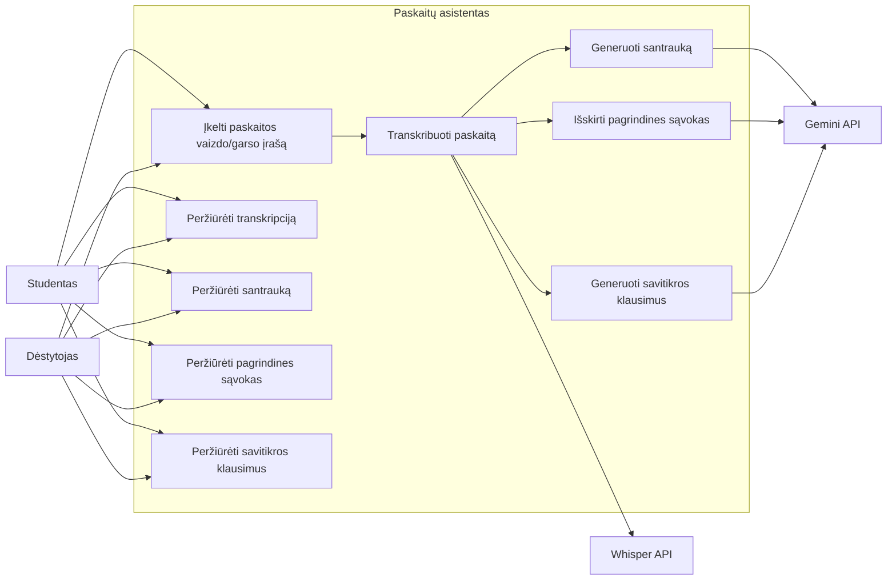
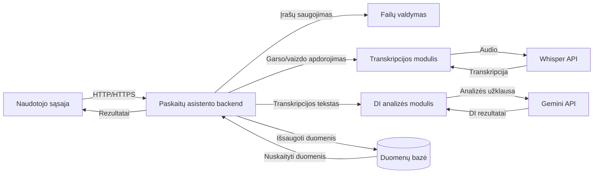
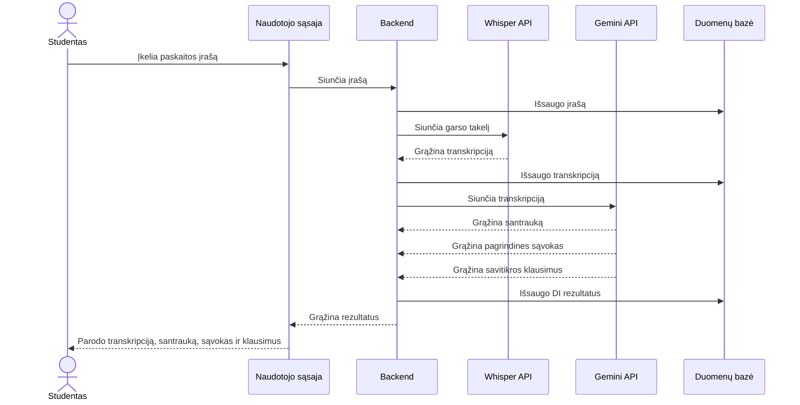

# lecture-assistant
# Paskaitų asistentas

Generatyvinio DI sistema, kuri iš paskaitos vaizdo/garso įrašo sukuria transkripciją (Whisper), santrauką, pagrindines sąvokas ir savitikros klausimus (Gemini API).

## Use case diagrama
Rodo pagrindinius naudotojo veiksmus ir sistemos sąveiką su Whisper bei Gemini API.

## Komponentų diagrama
Rodo pagrindinius sistemos komponentus ir jų sąveiką apdorojant paskaitos įrašą.

## Sekų diagrama
Rodo paskaitos įrašo apdorojimo seką nuo įkėlimo iki rezultatų pateikimo.

## Projekto struktūra
- `data/`: (X, y) pavyzdžiai
- `prompts/`: testinis promptas
- `diagrams/`: PlantUML ir Mermaid kodas
- `chatgpt/`: ChatGPT pokalbis
- `lecture_assistant.ipynb`: Colab prototipas

## ChatGPT pokalbis
[Nuoroda į pokalbį](ČIA_ĮKLIJUOK_SHARE_NUORODĄ)
