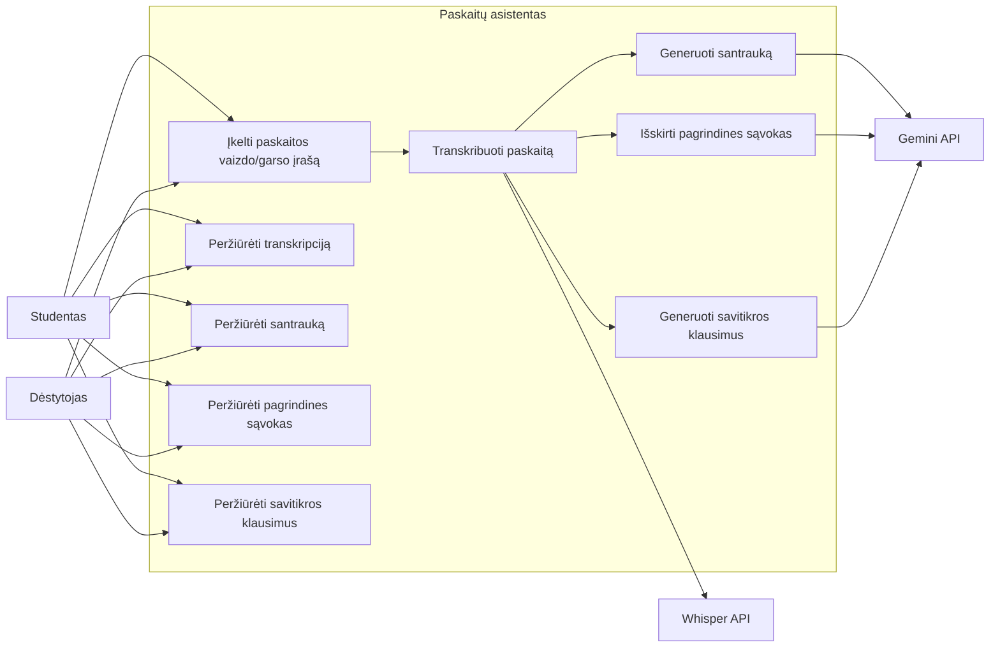
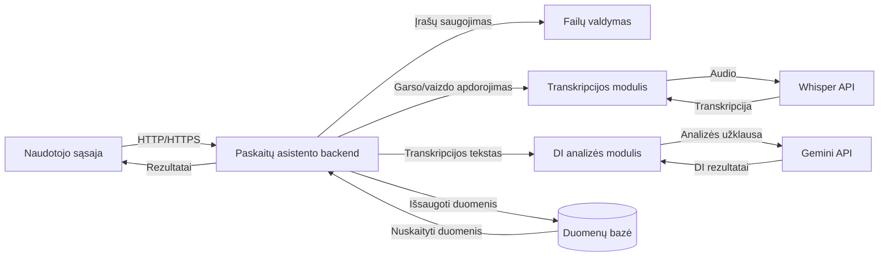
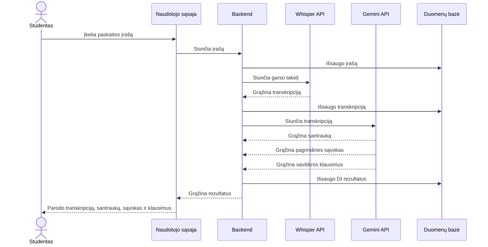

# Paskaitų asistentas

Generatyvinio DI projektas apie temą **„Paskaitų asistentas"**. Repozitorijoje du susiję darbai:

- **A dalis:** informacinė sistema, kuri iš paskaitos įrašo sukuria transkripciją (Whisper), santrauką, pagrindines sąvokas ir savitikros klausimus (Gemini API).
- **B dalis** (aplankas [`nlp-video-multimodal-extraction/`](nlp-video-multimodal-extraction/)): duomenų paruošimas iš tikrų paskaitų video: audio → transkripcija ir vidurinis kadras → paveikslėlio aprašymas.

---

## End-to-end pavyzdžiai: kas yra X ir kas yra y

**X** yra tai, ką pateikiame sistemai (įvestis). **y** yra tai, ką sistema grąžina (išvestis). Poros saugomos `data/` direktorijose.

### A dalis: paskaitos tekstas → santrauka, sąvokos, klausimai
- **X:** paskaitos transkripcija (`.txt`)
- **y:** JSON su laukais `santrauka`, `pagrindines_savokos`, `savitikros_klausimai` (Gemini API)

| Pavyzdys | X (įvestis) | y (išvestis) |
|---|---|---|
| 1. Neuroniniai tinklai | [`data/lecture1_input.txt`](data/lecture1_input.txt) | [`data/lecture1_output.json`](data/lecture1_output.json) |
| 2. Reliacinės duomenų bazės | [`data/lecture2_input.txt`](data/lecture2_input.txt) | [`data/lecture2_output.json`](data/lecture2_output.json) |
| 3. Scrum metodika | [`data/lecture3_input.txt`](data/lecture3_input.txt) | [`data/lecture3_output.json`](data/lecture3_output.json) |

**Pavyzdys (2):**

X:
```
Reliacinė duomenų bazė saugo duomenis lentelėse, sudarytose iš eilučių ir stulpelių. [...] Transakcijos užtikrina, kad kelių operacijų seka būtų įvykdyta visa arba visai neįvykdyta.
```

y:
```json
{
  "santrauka": "Reliacinės duomenų bazės saugo duomenis lentelėse ir naudoja SQL kalbą informacijai pasiekti bei lentelėms sujungti. Jose taip pat taikomas normalizavimas ir transakcijos duomenų vientisumui bei saugumui užtikrinti.",
  "pagrindines_savokos": ["Pirminis raktas", "Išorinis raktas", "SQL kalba", "Normalizavimas", "Transakcijos"],
  "savitikros_klausimai": [
    "Kam yra naudojamas pirminis raktas reliacinėje duomenų bazėje?",
    "Kokia komanda leidžia sujungti kelias lenteles pagal bendrą raktą?",
    "Ką padeda pasiekti duomenų bazės normalizavimas?",
    "Kokią funkciją atlieka transakcijos?"
  ]
}
```

### B dalis: paskaitos video → tekstas ir aprašymas
Iš kiekvieno video fragmento gaunamos dvi (X, y) poros (5 fragmentai, iš viso 10 porų):

| Užduotis | X (įvestis) | y (išvestis) | Pavyzdys |
|---|---|---|---|
| Kalbos atpažinimas (Whisper) | audio `.mp3` | transkripcija `.txt` | `nlp-video-multimodal-extraction/data/audio_data/1.mp3` → `nlp-video-multimodal-extraction/data/text_data/1.txt` |
| Paveikslėlio aprašymas (Gemini) | vidurinis kadras `.jpg` | aprašymas `.txt` | `nlp-video-multimodal-extraction/data/frame_data/1.jpg` → `nlp-video-multimodal-extraction/data/image_descriptions/1.txt` |

### Testinis promptas (`prompts/`)
[`prompts/test_prompt.md`](prompts/test_prompt.md) yra promptas, kurį įklijavus GPT agentui gaunamas atsakymas (JSON su santrauka, sąvokomis ir klausimais). Faile matosi ir promptas, ir gautas atsakymas.

### Visas procesas (end-to-end)
```
X (paskaitos tekstas / audio / kadras)
        │
        ▼
 DI modelis (Whisper arba Gemini API) + promptas
        │
        ▼
y (santrauka, sąvokos, klausimai / transkripcija / aprašymas)
```

---

# A dalis: Paskaitų asistento sistema

## Use case diagrama
Rodo pagrindinius naudotojo veiksmus ir sistemos sąveiką su Whisper bei Gemini API.



## Komponentų diagrama
Rodo pagrindinius sistemos komponentus ir jų sąveiką apdorojant paskaitos įrašą.



## Sekų diagrama
Rodo paskaitos įrašo apdorojimo seką nuo įkėlimo iki rezultatų pateikimo.



## ChatGPT pokalbis
Diagramos sugeneruotos su ChatGPT: [nuoroda į pokalbį](https://chatgpt.com/share/6abd695f-afa8-83ed-8629-2f338840403a). PlantUML ir Mermaid kodas yra `diagrams/` aplanke.

## Colab prototipas
[`lecture_assistant.ipynb`](lecture_assistant.ipynb): paskaitos tekstas → garso įrašas (Gemini TTS) → transkripcija (Whisper) → analizė (Gemini API) → rezultatai ir grafikas → JSON failas.

---

# B dalis: Multimodalinis duomenų išgavimas iš paskaitų video

Visi B dalies failai yra aplanke [`nlp-video-multimodal-extraction/`](nlp-video-multimodal-extraction/).

## Procesas
```
Paskaitos video (.mp4, 1 min. fragmentas)
        │
        ├──► audio (.mp3) ──► Whisper ──► transkripcija (.txt)
        │
        └──► vidurinis kadras (.jpg) ──► Gemini ──► aprašymas (.txt)
```
1. [`01_data_preparation.ipynb`](nlp-video-multimodal-extraction/01_data_preparation.ipynb): video fragmentai, audio (`moviepy`), transkripcija (Whisper), vidurinis kadras.
2. [`02_image_description.ipynb`](nlp-video-multimodal-extraction/02_image_description.ipynb): kadrų aprašymai per Gemini API.

Dėl laikinų Gemini serverių perkrovų (503) antrame notebook'e kodas kartoja užklausas ir, jei reikia, pereina prie atsarginių modelių, todėl skirtingi kadrai gali būti aprašyti skirtingais modeliais. Naudotas modelis matomas notebook'o išvestyje.

## Duomenų šaltinis
- **Kursas:** MIT OpenCourseWare, *6.0001 Introduction to Computer Science and Programming in Python* (Fall 2016)
- **Paskaitos:** Lecture 1, 2, 3, 5 ir 6 (po 1 min. fragmentą, nuo 2:00 min.)
- **Autoriai:** Dr. Ana Bell, Prof. Eric Grimson, Prof. John Guttag
- **Kurso puslapis:** https://ocw.mit.edu/courses/6-0001-introduction-to-computer-science-and-programming-in-python-fall-2016/
- **Licencija:** Creative Commons BY-NC-SA 4.0 (https://creativecommons.org/licenses/by-nc-sa/4.0/)

B dalies failai (video fragmentai, audio, kadrai, transkripcijos, aprašymai) yra išvestinė medžiaga, naudojama tik mokymosi tikslais, nekomerciškai ir platinama ta pačia licencija.

---

## Repozitorijos struktūra
```
├── README.md
├── lecture_assistant.ipynb          # A dalis: Colab prototipas (Gemini API)
├── chatgpt/                         # A dalis: ChatGPT pokalbis
├── diagrams/                        # A dalis: PlantUML ir Mermaid kodas
├── prompts/                         # A dalis: testinis promptas
├── data/                            # A dalis: 3 (X, y) poros
│   ├── lecture1_input.txt, lecture1_output.json
│   ├── lecture2_input.txt, lecture2_output.json
│   └── lecture3_input.txt, lecture3_output.json
└── nlp-video-multimodal-extraction/ # B dalis
    ├── 01_data_preparation.ipynb
    ├── 02_image_description.ipynb
    └── data/
        ├── video_data/              # 5 video fragmentai (.mp4)
        ├── audio_data/              # X: garso failai (.mp3)
        ├── text_data/               # y: Whisper transkripcijos (.txt)
        ├── frame_data/              # X: vidurinių kadrų paveikslėliai (.jpg)
        └── image_descriptions/      # y: Gemini aprašymai (.txt)
```

## Kaip paleisti
1. Atidaryk notebook'ą per Google Colab.
2. Notebook'ams su Gemini Colab **Secrets** (🔑) pridėk `GOOGLE_API_KEY` (raktas iš [Google AI Studio](https://aistudio.google.com)) ir įjunk **Notebook access**.
3. `01_data_preparation.ipynb` rekomenduojama **T4 GPU** (Runtime → Change runtime type).
4. Paleisk langelius iš eilės. B dalyje pirmo notebook'o rezultatai (`frame-data.zip`) įkeliami į antrą per `files.upload()`.
